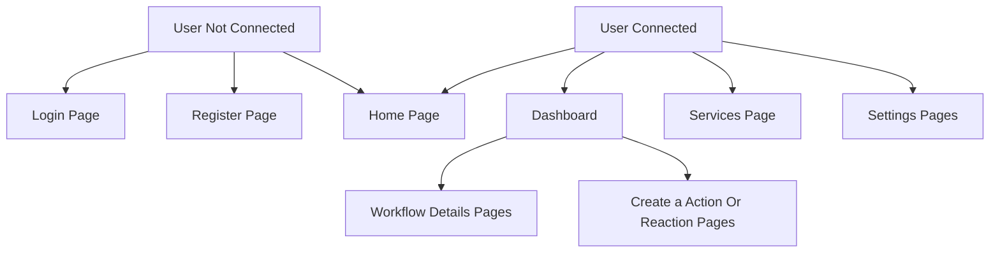

# Mobile

Welcome to the mobile documentation where you will find everything related to the mobile version of the project. \
If you haven't already, check out the POC of mobile and the comparative study documentation [_here_](./POC.md#mobile).

# Global Documentation

## Figma / Accessibility

If you haven't seen the frontend documentation page yet, go check it out [_here_](./Frontend.md) to see the [_Figma_](./Frontend.md#figma--ui) and the [_Accessibility_](./Frontend.md#accessibility) parts that goes the same for the mobile version of the website.

## App Architecture

The Area51 app is organised this way:

### User Not Connected

- A user who is not connected can navigate to the following pages:
  - **Login Page**: This page allows users to enter their credentials (username and password) to access their accounts. It usually includes options for password recovery and links to register for new accounts.
  - **Register Page**: This page provides a form for new users to create an account. Users need to provide personal information such as their name, email address, and create a password.
  - **Home Page**: The main landing page of the application. It usually provides an overview of the services and features available, along with navigation links to other important sections of the site.

### User Connected

- A user who is connected can navigate to the following pages:
  - **Home Page**: The main landing page of the application. It usually provides an overview of the services and features available, along with navigation links to other important sections of the site.
  - **Dashboard Pages**: This section includes various pages that provide an overview and management tools for workflows and activities.
  - **Services Page**: This page displays a list of services available to the user, allowing them to browse, select, and manage different services.
  - **Settings Pages**: These pages allow users to configure their personal settings, account details, preferences, and application settings.

### Dashboard Pages

- Within the Dashboard Pages, a user can navigate to:
  - **Workflow Details Pages**: These pages provide detailed information and management options for individual workflows, allowing users to view, edit, and monitor their workflows.
  - **Create an Action or Reaction Pages**: These pages enable users to create new actions or reactions as part of their workflows, providing a form and tools to define new automation tasks.

</br></br>



# Dev Documentation

## Languages

### React Native:

- For our mobile development, we chose to use _React Native_. React Native is a popular framework for building cross-platform mobile applications using JavaScript and React. It allows us to write a single codebase that runs on both iOS and Android, significantly reducing development time and effort.

- React Native provides a rich set of components and APIs that enable us to create a native-like user experience. Its hot-reloading feature allows for rapid development and iteration, making it easier to test and debug the application. Additionally, React Native has a strong community and a vast ecosystem of libraries and tools, which helps us to quickly find solutions and integrate third-party services.

- By using React Native, we can use our existing knowledge of React and JavaScript to build high-quality mobile applications. The framework's performance and flexibility make it an excellent choice for our project, allowing us to deliver a seamless and responsive user experience across multiple platforms.

### TypeScript:

- For our mobile development, we chose to use TypeScript. TypeScript is a popular programming language that is a typed superset of JavaScript. It allows us to write safer and more maintainable code through its static type system.

- **[TypeScript](https://www.typescriptlang.org/docs/)** offers numerous features that help us develop high-quality applications. Its static typing enables the detection of errors at compile-time rather than run-time, reducing bugs and enhancing code robustness. Additionally, it is fully compatible with JavaScript, making the transition and gradual adoption easier.

- By using TypeScript, we can benefit from advanced features such as auto-completion, type checking, and code navigation, which speed up development and improve productivity. TypeScript also has a vast community and a rich ecosystem of libraries and tools, facilitating the integration of third-party solutions and code sharing between projects.

- With TypeScript, we can leverage our existing knowledge of JavaScript while enjoying the added safety and reliability provided by static typing. The flexibility and performance of TypeScript make it an excellent choice for our project, allowing us to deliver a responsive and performant mobile application across multiple platforms.

## External Libraries

- **Async Storage**: An asynchronous, unencrypted, persistent, key-value storage system for React Native.
- **React Navigation Bottom Tabs**: Bottom tab navigator for React Navigation.
- **React Navigation Native Stack**: Native stack navigator for React Navigation.
- **React Navigation Native**: Navigation library for React Native apps.
- **React Navigation Stack**: Stack navigator for React Navigation.
- **Types for React Native Modal Dropdown**: TypeScript definitions for react-native-modal-dropdown.
- **Types for React Native Vector Icons**: TypeScript definitions for react-native-vector-icons.
- **Types for React Test Renderer**: TypeScript definitions for react-test-renderer.
- **Types for React**: TypeScript definitions for React.
- **React Icons**: Include popular icons in your React projects easily with react-icons.
- **React Native App Auth**: React Native bridge for AppAuth-iOS and AppAuth-Android SDKs for communicating with OAuth2 providers.
- **React Native Dotenv**: A Babel preset to load your .env file into your application.
- **React Native Gesture Handler**: Gesture handler library for React Native.
- **React Native Modal Dropdown**: A customizable, simple dropdown for React Native.
- **React Native Safe Area Context**: A flexible way to handle safe area insets in React Native apps.
- **React Native Screens**: Native navigation primitives for your React Native app.
- **React Native SVG Transformer**: A transformer for loading SVG images into your React Native app.
- **React Native SVG**: A library to render SVG images in React Native.
- **React Native Vector Icons**: Customizable icons for React Native with support for NavBar/TabBar/ToolbarAndroid, image source, and full styling.
- **React Navigation Stack**: Stack navigator for React Navigation.
- **React Navigation**: Routing and navigation for your React Native applications.

## Folder Architecture

For the architecture, we decided to adopt a simple yet efficient structure to split and use the mobile version on IOS and Android.

The key directories in our architecture are:

- **src**: This is the main directory to code in. You have all the React Native code in this directory:

  - **_components_**: Where all the components are: ServiceCard, IPInput...
  - **_context_**: The application context where local variable is stock
  - **_icons_**: icons of the app.
  - **_navigation_**: Gestion of the navigation between the screen
  - **_screens_**: All the main website pages like Home, Login, Register...
  - **_services_**: All the "server side" things.
  - **_styles_**: Where the global app theme is stock.
  - **_types_**: All the types that we use to get info from the backend side are there.

- **ios**: It is where all the files and directories for the IOS to function correctly.
- **android**: Same as the IOS directory. This is where all the important files, for the android to run correctly, are.

To properly use React Native we ensure everything is clean and organized so we can develop our features the best way we can.

Here's the complete guide for starting the Area51 app:

## How to Start the Area51 App

### Initialisation

- If you have never developed on React Native without Expo:
  - [click here](./MobilePrerequise.md)

### Clone the Repository

```sh
git clone git@github.com:Epitouche/Area51.git
cd Area51
```

### Initialise the Project

```sh
cd mobile/
npm install
```

### Set up your .env

 - #### Root environment
```
# APP ENV
APP_PORT=''
FRONTEND_PORT=''
JWT_SECRET=''
APP_HOST_ADDRESS=''
DEFAULT_PASSWORD=''

# GITHUB ENV
GITHUB_CLIENT_ID=''
GITHUB_SECRET=''

#SPOTIFY ENV
SPOTIFY_CLIENT_ID=''
SPOTIFY_SECRET=''

# MICROSOFT ENV
MICROSOFT_CLIENT_ID=''
MICROSOFT_SECRET=''
MICROSOFT_TENANT_ID=''

# POSTGRES ENV
POSTGRES_PASSWORD=''
POSTGRES_DB=''
POSTGRES_DB_HOST=''
POSTGRES_USER=''
DB_HOST=''
DB_PORT=''

# PGADMIN ENV
PGADMIN_DEFAULT_EMAIL=''
PGADMIN_DEFAULT_PASSWORD=''
PGADMIN_DEFAULT_CONFIG_SERVER_MODE=''
PGADMIN_DEFAULT_CONFIG_ENHANCED_CSFR=''
```

 - #### mobile/ environment

```
# GITHUB ENV
GITHUB_CLIENT_ID=''
GITHUB_SECRET=''

#SPOTIFY ENV
SPOTIFY_CLIENT_ID=''
SPOTIFY_SECRET=''

# MICROSOFT ENV
MICROSOFT_CLIENT_ID=''
MICROSOFT_SECRET=''
MICROSOFT_TENANT_ID=''

# GOOGLE ENV
GOOGLE_SECRET=''
GOOGLE_CLIENT_ID=''
GOOGLE_MOBILE_ID=''
```

### Launch the App

#### Option 1: Using an Android Emulator

1. **Open Android Studio**:

   - Launch Android Studio and open the AVD Manager.
   - Create a new virtual device if you don't have one already.
   - Start the Android emulator.

2. **Run the app on the emulator**:
   - Make sure the emulator is running, then execute:
   ```sh
   npx react-native run-android
   ```

#### Option 2: Using a Physical Android Device

1. **Enable USB Debugging on your device**:

   - Go to `Settings` > `About phone` and tap `Build number` seven times to enable developer options.
   - Go to `Settings` > `Developer options` and enable `USB debugging`.

2. **Connect your device to your computer**:

   - Use a USB cable to connect your Android device to your computer.
   - Verify the connection by running:

   ```sh
   adb devices
   ```

   - Your device should be listed.

3. **Run the app on the device**:
   ```sh
   npm strat
   ```

## For Sing the Area51 app

- ### [click here](./MobileSign.md)

## Area51 app view

https://drive.google.com/file/d/17N3K4B_Jb8drptCRV3bVdeZ-DuNixStj/view?usp=drivesdk
