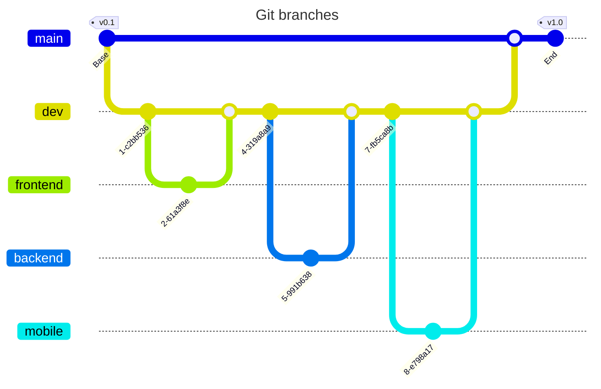

# Organization

During the whole project we had to organize everything that we were doing and organize ourselves to be more efficient and capable of putting our best to work.

To keep everyone on the same page and have an almost perfect project organization we decided to go on a SCRUM-like organization. What does it mean ? It means that we have sprints of 2 weeks for the whole duration of the project.

We have daily meeting to put everyone on the same page, to know what everyone has done and know what everyone will work on. The dailies are very important because it keeps everyone on the team on the same page so that all the team have the same exact informations about the projects.

## Google Drive

We utilized Google Drive as our central repository for all project-related documents. This includhereed sprint notes, design documents, proof of concept (POC) reports, and other important resources. \
By storing everything in Google Drive, we ensured that all team members had easy access to the latest information and could collaborate effectively in real-time. The structured folder system helped us keep everything organized and easy to find.

The link to our google drive is right [*here*](https://drive.google.com/drive/folders/1Z0oZLYy2zBhhryj8Y1aOzdajEbtKuYpq).

## GitHub

### Github Project

We used GitHub Projects for sprint planning, issue tracking, and task management. This tool allowed us to create and manage tasks, assign them to team members, and track their progress.

By integrating GitHub Projects with our repository, we could easily link issues and pull requests to specific tasks, ensuring that everything stayed connected and up-to-date. This approach helped us maintain a clear overview of the project's status and prioritize work effectively.

All tasks are separated into three categories that determine what the person linked to the card will work on :
- Frontend
- Backend
- DevOps

The link to our github project is right [*here*](https://github.com/orgs/Epitouche/projects/2).

### Branches

Now, let's see how we use the github branches. For the names of the branches we use what is called the "kebab-case". It means that when we want to code a card feature like this one : "Frontend | Code - Web View - Home Page" becomes this in branch name : "frontend-code-web-view-home-page". Even if it is a bit long, it allows us to easily link the branch to a card in the github project.

Our branches architecture looks like this *little* graph:

First we have the original **main** branch with a **dev** branch for all the changes that will go on main, once we decided it was time to merge everything (see the dev branch as a test for main).

After that, we have three **features** branches. It means that these three branches are the main branches for the features of each category.
The "frontend" branch have everything with web view frontend related features. It goes the same for the "mobile" branch but it is only for the mobile view. The "backend" branch has the same but for the backend side of the project.

We also have few other branches but they have very few commits and tasks so it was unnecessary to put them in the graph but the few others are DevOps, documentation and some POC different branches.

### Commits

For the commits we decided to go on a simple **commit naming convention** :
- "[ADD] File and/or folders affected by the commit" "Description of what has been added in each file."

If you want to see the others check it [*here*](https://docs.google.com/document/d/1JRWCsIwZGD9q2ZuTiY117qcswexsDutevPy90z75hJ8/edit?tab=t.0).
