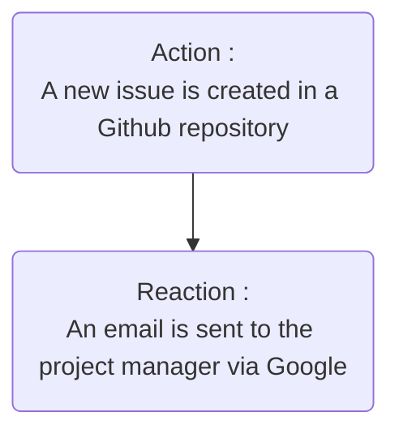

# Services

Welcome to the services documentation where you will find everything related to the services used for this project.

### Google Drive

Link to the folder of the google drive related : [Services](https://drive.google.com/drive/folders/1DB13jL5AZHboqqtxwosQ_k78navmMrfO)

## About

At the start of the project we had to choose several services to make in all of our project. The services are already existing **API** that we are using to make the AREA work.

As you may already know an **AREA** works by connecting **Action** with **REAction**. All of this works using existing API like Google API, the Spotify web API or Interpol Notices API (Yeah, to know if someone that contributes to your repository on github is search by Interpol, quite nice).

For the project we also had some inspiration from other websites that uses the AREA system. We knew two websites : **Zapier** and **IFTTT**. \
These two website are very well known AREA website that exists for a long time now and that uses several kinds of techniques to better suite the user in their own AREA system. Let's take Zapier for example, they aim for a modern alternative with the integration of AI in their Action or Reaction like ChatGPT. Instead, IFTTT aims for a more mobile approach to seduce a certain part of users. \
Our aim was to do a nice looking AREA website that would be very well suited for computer as well as a mobile phone.

## Our services

In our search for all the services that we were going to implement, we stumbled upon a very useful github repository that listed all kinds of API. Very useful in our case. Here is the link to this github repository : [public-apis](https://github.com/public-apis/public-apis)

For the project we had to choose exactly **7 services** to meet our needs, here is the name of the services :
- Github
- Stripe
- TMDB
- Google
- Interpol
- Microsoft
- Spotify

Here is the link to our list of services with example of Action REAction : [link](https://docs.google.com/document/d/1aUjQjh-PXsvZBNcvug_akDXQm7c0KKCYHwNhgjf-AfE/edit?tab=t.wssc4j3o35lb)

## Action-REAction

Since the beginning you are maybe wondering what does an action or a reaction looks like. Well then let's take a look at it.

An **action** is an event that we detect from a service. For example, an action could be a new issue created in a GitHub repository, a new payment received in Stripe, or a new song added to a Spotify playlist. These actions are the triggers that initiate a workflow.

An **example action**:
- **Service**: GitHub
- **Action**: New issue created
- **Description**: This action is triggered whenever a new issue is created in a specified GitHub repository.

A **reaction** is the response that we execute when an action is detected. For example, a reaction could be sending an email notification, creating a new task in a project management tool, or adding a new song to your favorite playlist. These reactions are the outcomes that complete a workflow.

An **example reaction**:
- **Service**: Google
- **Reaction**: Send an email
- **Description**: This reaction sends an email notification to a specified address when triggered by an action.

### Example Workflow

To illustrate how actions and reactions work together, let's consider a complete workflow example:

1. **Action**: A new issue is created in a GitHub repository.
2. **Reaction**: An email notification is sent to the project manager via Google.

In this example, the workflow is triggered by the creation of a new issue in GitHub (action). The system then responds by sending an email notification to the project manager (reaction), informing them of the new issue.

By combining various actions and reactions, we can automate a wide range of tasks and workflows, making our processes more efficient and reducing the need for manual intervention. That is what an AREA is used for.
